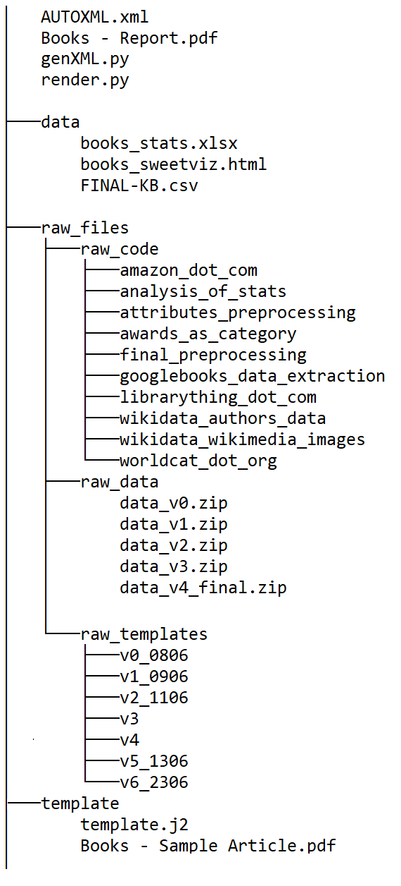

# Books

Welcome to the repository of "Books"! Follow the guide below if you'd like to navigate across this repository and view files, or if you'd like to implement specific chunks of this project on your computer.

You may also check this detailed **report** on the Tewiki Books project [here](https://github.com/indicwiki-iiit/Books/blob/main/Books%20-%20Report.pdf) to know how to navigate through all the files listed here, and to know the multiple technical and other facets of this project.

## Guide to using these files/implementing/testing

* Download this repository as a ZIP, or clone it to your computer.
* To test article rendering for a single record, use the script "**render.py**".
* To test article rendering and XML Generation for all records in the database, use the script "**genXML.py**".
* Both of the aforementioned scripts need the template of the article and the database, which are in the folders **template** and **data** respectively, so make sure both of these folders are present in your cloned copy.

If you'd like to know more about the scripts used to construct the database and the template, visit the [raw_files](https://github.com/indicwiki-iiit/Books/tree/main/raw_files) folder. 

To know what the rendered article would look like, before you render it, check out the "Books - Sample Article.pdf" file or [this](https://github.com/indicwiki-iiit/Books/blob/main/Books%20-%20Sample%20Article.pdf) document.

## Navigational Guide

### 📁 [data](https://github.com/indicwiki-iiit/Books/tree/main/data)
Visit this folder to view the following files, or for some trivia on - 
* The Final database **FINAL-KB.csv** used to generate all the articles in this project
* Stats of the Byte count of all the articles generated 
* Stats of attributes and values in the database ( Sweetviz Report )
* Details about the attributes which underwent Translation and Transliteration

### 📁 [raw_files](https://github.com/indicwiki-iiit/Books/tree/main/raw_files)
Visit this folder to view/find/test some behind the scenes content of this project, such as - 
* Code used for extracting data from sources, web scraping, preprocessing, etc.
* Various versions of the dataset we've worked on, in due course of this project
* Various versions of the template 

### 📁 [template](https://github.com/indicwiki-iiit/Books/tree/main/raw_files)
Visit this folder to find the final version of the template we've used to generate all the articles, **template.j2**.

### 🗎 AUTOXML.xml
This is the final XML File generated, enclosing articles on 6500 books, i.e. spanning over all records of the database.

### 🗎 Books - Report. pdf
Read this comprehensive report on this project to know more about the technical facets of this project, tools used to overcome issues encountered, some factual details, and a lot more.

### 📜 render.py
Use this file if you'd like to try rendering one article. Note that this should be run only after the entire repo is cloned/downloaded, since this script needs access to the template and dataset lodged in other folders.

### 📜 genXML.py
Use this file if you'd like to generate the XML file comprising of records from all 6500 books in the database, enclosed within mediawiki tags. Note that this should be run only after the entire repo is cloned/downloaded, since this script needs access to the template and dataset lodged in other folders.

