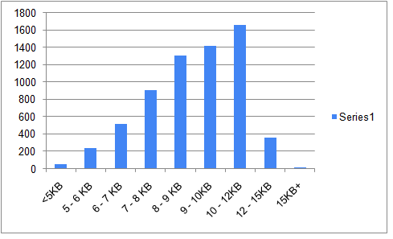

## Dataset Description

Read through this box for a description on the dataset we've used in this project.   
The dataset contains values corresponding to attributes in English, and also in their translated/transliterated Telugu versions.

#### Some Basic Info about the Dataset
Rows x Columns Stats of the Dataset   : 6500 x 73   
Number of Columns with English values : 50   
Number of Columns with Telugu values  : 23   

#### Generated Articles - Stub (vs) Generic
Stub Articles, i.e. <5KB : 57  
Generic Articles, i.e >= 5KB : 6443

The following chart has been plotted based on byte count of all the articles generated.

## Navigation

### 🗎 Dataset
The dataset we've used in this project - "**FINAL-KB.csv**".

### 🗎 Stats, books_stats.xlsx
The file **books_stats.xlsx** comprises of the following statistics/details of the data we've used, i.e. FINAL-KB.csv. The details are as follows - 
* Sheet1 : A list of the attributes used in each section of the article, and a brief description of the section.
* Sheet2 : A list of the attributes which had to be translated, transliterated and had to be used unchanged.
* Sheet3 : Byte, Character and Word Count of each book ( calculated on the basis of the number of words generated when the template of a book is rendered to Wikipedia )
* Sheet4 : Boolean Representations of each attribute and its missing/non missing values ( in this sheet, if an attribute's value corresponding to a record is 1, it is a non null value, else, it is a null value. )
* Sheet5 : A list of the number of non null values corresponding to each attribute.

### 🗎 Sweetviz Report, books_sweetviz.html
To view stats of attributes and the values they contain, visit the "**data_sweetviz**" HTML file in this folder.
